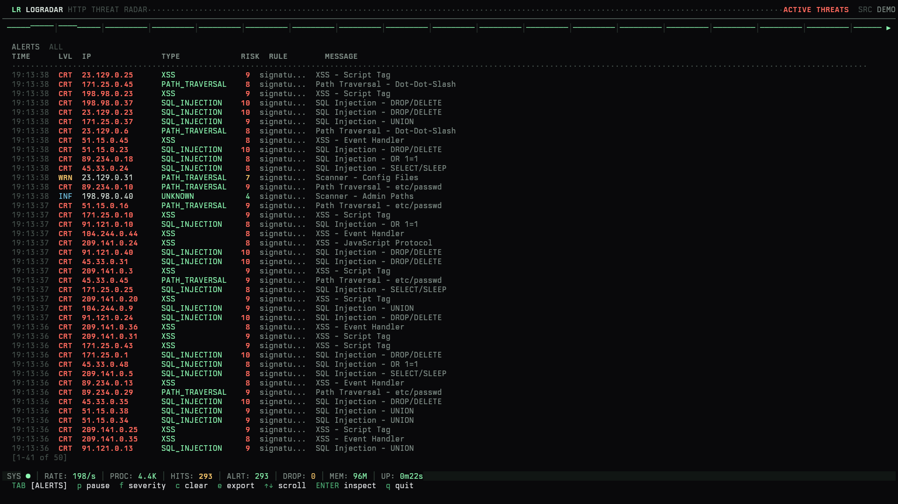
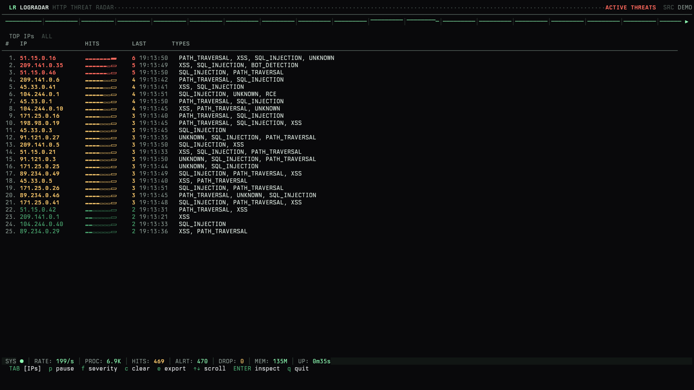
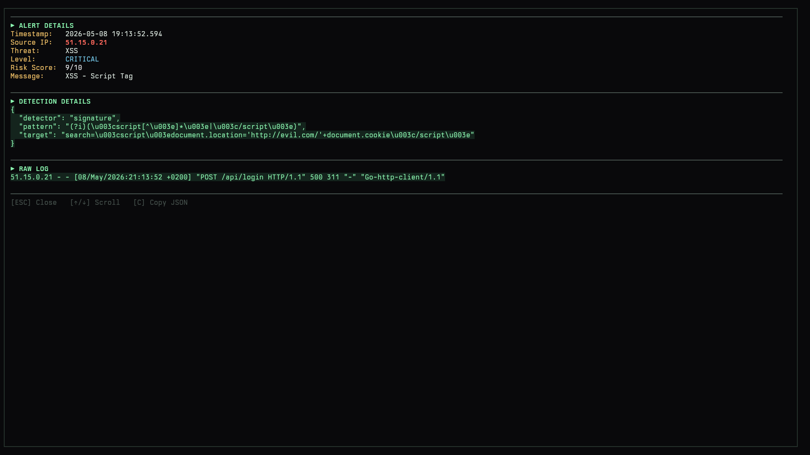

# LogRadar

LogRadar is a Go-based HTTP access-log threat detector. It reads live or batch log streams, detects suspicious request patterns, and surfaces alerts through an interactive TUI, JSON Lines output, and Prometheus metrics.

It is designed as a practical defensive engineering project: fast enough for realistic log volumes, observable enough to run as a service, and small enough to audit without hiding the detection logic behind a black box.



## Highlights

- Detects SQL injection, XSS, path traversal, RCE, LFI, Log4Shell-style probes, brute-force behavior, rate abuse, and local threat-intel matches.
- Supports `combined`, JSON, and auto-detected log formats.
- Runs against files, stdin, synthetic demo traffic, or live tailing.
- Ships an interactive Bubble Tea TUI for live triage.
- Emits JSON alerts for pipelines and batch workflows.
- Exposes Prometheus metrics plus readiness and liveness endpoints.
- Includes docs for configuration, monitoring, deployment, alert schema, and operations.

## Quick Start

```bash
make build
./bin/logradar analyze --demo --demo-rate 1000
./bin/logradar analyze --log /var/log/nginx/access.log --no-tui
journalctl -u nginx -o cat | ./bin/logradar analyze --stdin --no-tui
./bin/logradar analyze --log ./access.log --batch --json
```

`--batch` exits at EOF and returns code `2` when active alerts were emitted, which makes it useful in CI or forensic replay jobs.

## Detection Model

LogRadar combines three simple, explainable layers:

| Layer | Purpose |
| --- | --- |
| Signatures | Known attack strings and rule-file patterns |
| Behavioral | Repeated failures, request bursts, and suspicious client behavior |
| Threat intelligence | Local malicious IP feeds backed by efficient lookup structures |

The project favors transparent detection and operational safety over "AI magic". Rules can be inspected, tuned, and loaded from configuration.

## Inputs and Outputs

Supported input formats:

- `combined`: IP, method, path, status, bytes, and User-Agent.
- `json`: includes headers, cookies, and body fields.
- `auto`: tries JSON first and falls back to combined.

See [docs/log-formats.md](docs/log-formats.md).

Outputs:

- Interactive TUI by default.
- JSON Lines with `--json` or `output.json.enabled=true`.
- Prometheus metrics on `/metrics`.
- Readiness on `/ready` and liveness on `/live`.

 

The alert schema is documented in [docs/alert-schema.md](docs/alert-schema.md).

## Configuration

LogRadar looks for configuration in:

1. `--config /path/config.yaml`
2. `./configs/config.yaml`
3. `/etc/logradar/config.yaml`

`LOGRADAR_*` environment variables can override configuration keys. See [docs/configuration.md](docs/configuration.md).

## Docker

```bash
docker compose --profile demo up --build
LOGRADAR_LOG_FILE=/var/log/nginx/access.log docker compose --profile file up --build
docker compose --profile demo --profile monitoring up --build
```

The maintained monitoring path is Prometheus. Grafana is not part of the maintained deployment.

## Performance Notes

The benchmark documentation includes a reproducible methodology and reporting template. One documented smoke test observed about 185k demo events per second with 12 workers:

```bash
make build-prod
./bin/logradar analyze --demo --demo-rate 185000 --workers 12 --no-tui --json
```

Actual throughput depends on CPU, log format, output mode, detector configuration, and whether metrics or checkpointing are enabled. See [docs/benchmarks.md](docs/benchmarks.md).

## Development

```bash
make test
make lint
make fuzz
make docker
```

Useful docs:

- [Configuration](docs/configuration.md)
- [Detection](docs/detection.md)
- [Monitoring](docs/monitoring.md)
- [Deployment](docs/deployment.md)
- [Runbook](docs/runbook.md)
- [Development](docs/development.md)

## License

GPL-3.0-only. See [LICENSE](LICENSE).
